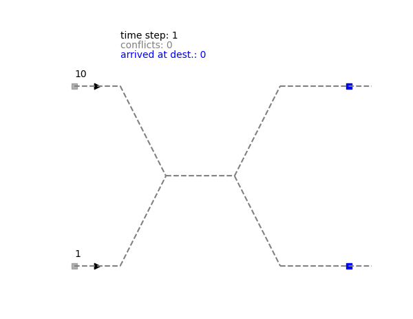
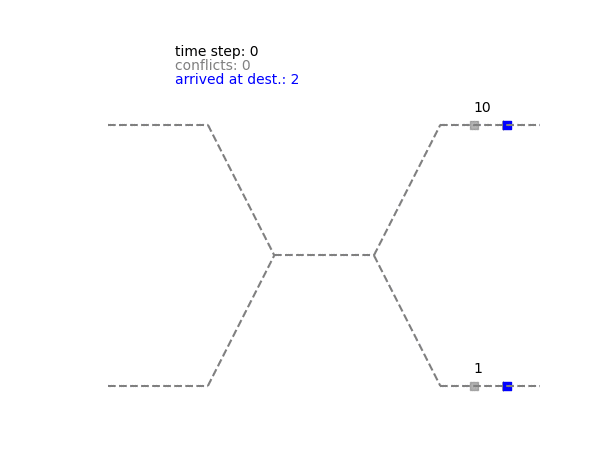
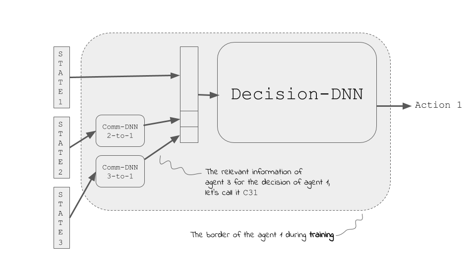
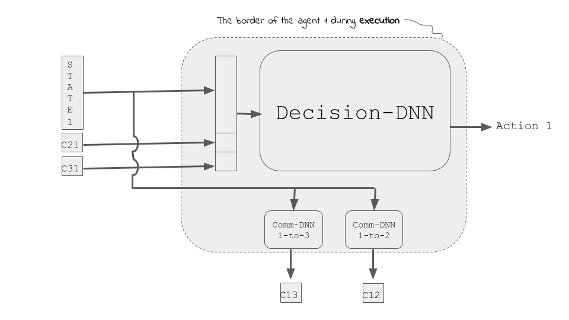

# communicative-MARL-v1

A multi-agent RL implementation is presented where the agents learn *what* to communicate with each other to achieve their goals optimally. 

This method is tested on a system of trains; the trains should achieve the following goals collectively through inter-communications:

* avoid **conflicts** and simultaneously
* minimize the total **priority weighted delay**

The priorities of the trains are proportional to the number of the passengers they have. Here, we solve this problem starting from any state of the system (regardless of all the previously happened delays). 

The multi-agent RL method used here can be categorized as a version of a centeralized learning / decenteralized execution, where during the execution some minimal albeit essential information is passed between the agents. This information enables the agents to coordinate between each other. The details of the chosen algorithm, its advantages and short-comings are presented in detail at the end of this document. Let's first start with the environment/rewards and the obtained results.


## The environment

The environment used here is a modified version of the [multi-agent-trains-env](https://github.com/nima-siboni/multi-agent-trains-env) which is an environment developed to be specifically RL-friendly.

The major introduced modification concerns the reward engineering. In the original implementation, both of the agents receive a large negative reward as soon as a conflict happens. With a slight modification, here only the agent which enters into a currently occupied track receives the negative reward. Also the magnitude of the reward is larger if the low-priority train blocks the way for the high-priority train. 

For simplicity, I have considered only two trains.

## Results

The results of the simulations for a two-trains system are demonstrated here. In each of the demonstrations, the priority of the agents are depicted by the numbers  written on top of them, and as soon as the trains cause a conflict their colors turn to red. As an extreme case, here we have chosen the number of passengers such that one of the trains has 10 times larger priority  compared to the other one.

To have a reference for the effect of the training, we first present simulation results where
* the agents move randomly 


* the agents are trained to get to their destinations as fast possible:



Not surprisngly, in the random walk case the delays are large and in the case where the agents greedily want to get to their destination, the conflicts are guaranteed.

Here is a simulation of the behavior of the agents after training.



One can see that interestingly the agents both arrive at the junction, the low-priority train waits for the high-priority agent to pass the middle area, and then continues as fast as possible to its destination.


## Future steps

* An extension where the passengers can get on and off of the train can be interesting. In this scenario the priority of the trains might change during their journey. 

* Here agents are optimizing the objectives *solely* based on their current state. This means that decisions are made regardless of delays occurred prior to the current time, and also **no forecast of future delays**. An interesting extension of the current approach would be to add a delay-prediction ability to the agents. The predicted future delays can be used together with the current state for making better decisions. This can be approached using common AI/non-AI approaches for forecasting sequences of events. 

This makes sense for the train system, as if a technical problem leads to a lets say blockage of a segment, the agent

* It is very interesting to figure out what agents have learned to communicate. Can all the communication networks be replaced by only one communication network, given that the system is homogeneous enough?

* Coding: a cleaner separation of the sub-networks of each agent, by explicit separation of the different networks (partially done in ```agent-under-construction.py```


## The MARL approach

One route to MARL is to compose a global agent which determines the actions of all the agents based on the global state of the system. Such a fully centralized approach is simple to implement and the best affordable approach considering the stability and convergence. Essentially such an approach converts the multi-agent problem to a single agent problem. This way all the techniques developed for single RL can be used, and one can benefit from the convergence (to optimal and sub-optimal solutions) and stability of the exisiting algorithms. An example of such an approach is implemented here in [narrow-corridor-ai](https://github.com/nima-siboni/narrow-corridor-ai), where the globally optimal solution is obtained using a tabular value based method.

Although such a centralized can be used to solve many multi-agent RL problems, in practice this is not always feasible: 

* One common challenge is that the super-agent becomes large and unfeasible to train as the number of agents grow (yet another example of curse-of-dimensionality!). 

* Another challenge for this approach occurs during the execution phase, namely such a super-agent requires *all* the information of all the agents to make a decision. This might make the usage of RL impossible in settings where the required infrastructure for such a massive data communication does not exist or the communication is slower than the timescale relevant for the decision making process. This can be a problem both in cases where the agents are separated in the real world, or in-silico across different computational nodes (of a distributed system). 

These challenges have led to recent developments in devising new multi-agent algorithms where the learning and the execution phases are less centralized. A successful example of such methods is the centralized-learning/decenteralized-execution approach proposed in Refs. [[1](https://arxiv.org/pdf/1706.02275.pdf)-[2](https://arxiv.org/pdf/1605.06676.pdf)]. The decentralized execution, here, means that each agent has only access to its own state (which solves the communication challenge mentioned above), and the centralized learning means that the agents have full access to each other's states (and actions)  during this phase. This is an approach which has proven to be successful to tackle the mentioned challenges in many practical instances. 
In the aforementioned approach, the elimination of the communication problem during the execution phase is achieved by assuming that the agents can take actions without the information from the other agent. This is not only a restrictive assumption for many examples, but also it restricts our choice for the RL algorithm. To be more precise, the used algorithm should be able to handle the situation that the agents learn using all the information, but take actions using only their own state.  In the aforementioned Refs., the authors achieved this via using Actor-Critic method, where only the Critic requires the global information. That other RL algorithms, e.g. DDQN, can not be used in this setup. This restriction becomes a problem particularly in situations where a value based method would be a better candidate to solve the problem at hand (than the Actor-Critic method). In this project, we turn to a method which does not have this restriction, and also curbs the challenge of the communication.
The approach we present and implement here can be considered as a semi-independent execution with semi-centeralized learning, as explained in the followings.


### Learning phase

During the learning process, each agent learns independently,  based on the rewards it gets for its actions knowing the state of all other agents. An essential element here is that during the learning phase, the states of all other agents are presented to the agent. This is essentially similar to the approach taken in Refs. [[1](https://arxiv.org/pdf/1706.02275.pdf)-[2](https://arxiv.org/pdf/1605.06676.pdf)]. This step, if done naively, could lead to the curse of dimensionality problem, as explained above. To avoid that, we consider a network similar to the one shown below.



In this architecture, the input for each agent's network is not a concatenation of all the states of all the agents.  Each  agent makes the decision based  on (i) its own state and (ii) processed information about the other agents (i.e. on the essential information extracted from the state of the others).  An important question would arise at this point: what is the condensed essential information composed of? Do we need to know that and hard-encode it in the solution? As explained in the following, we avoid this and let the agents learn by themselves what is the important information to be exchanged between each pair.

In this approach, the we extract of the above mentioned information using a (rather small) DNN.  This network is used to convert the state of each agent to a lower dimensional information which is used for decision making. Importantly, in our approach, the weights of this network is learned during the training phase as a part of each agent training. In other words, for each agent, we have light *communication-networks* which condense the state of all the agents to a low dimensional representation and use these information for decision making.
In summary, each agent has two sub-network types:
* a dense neural network (DNN) which condenses the information of other agents, i.e. **communication DNN**, and* the **decision-DNN** which takes the action based on the state of the agent and the output of the above mentioned communication DNNs.
Given that the processed information of each agent would be much smaller than its state, we can keep the network of each agent relatively simple (significantly simpler than a network which decides on the global information directly). 

### Execution phase

As explained above, each agent needs to have the state of all other agents, condense them through the communication networks, and use this information together with its own state to finally take an action. This requires that before each step all the agents exchange their states with each other, which is one the bottlenecks of a super-agent approach which we want to avoid. 

One can reduce the amount of communications between the agents significantly in the above setting, without any loss of information. The key point is that to take an action, each agent only requires the *outputs* of its communication networks. In the current setting, to obtain these outputs, the agent requires to know the complete state of all other agents. Here, instead, we suggest a different approach: in each case the agents can process their own state and then send the outputs to their communication partners. This way, instead of the whole state of the agent, only the output of its communication networks are sent around, and this is exactly the information which each agent needs from the other agents. 

This new architecture requires that the communication networks are exchanged between the agents at the end of the training. The picture below shows that this structural changes for an agent.



## Cons and Pros / Further tests

To be filled.


## How to use 

To be filled in details, but the short version is:

Run ```learn-and-experience.py``` for the agents to learn, and ```simulate.py``` to run simulations for the random, the greedy, and trained agents! Both of the scripts are well-commented. 

## References

[1] [Multi-Agent Actor-Critic for Mixed Cooperative-Competitive Environments](https://arxiv.org/pdf/1706.02275.pdf), R. Loewe, et al (2020).

[2] [Learning to Communicate with Deep Multi-Agent Reinforcement Learning](https://arxiv.org/pdf/1605.06676.pdf), J. N. Foerster, et al (2016).
